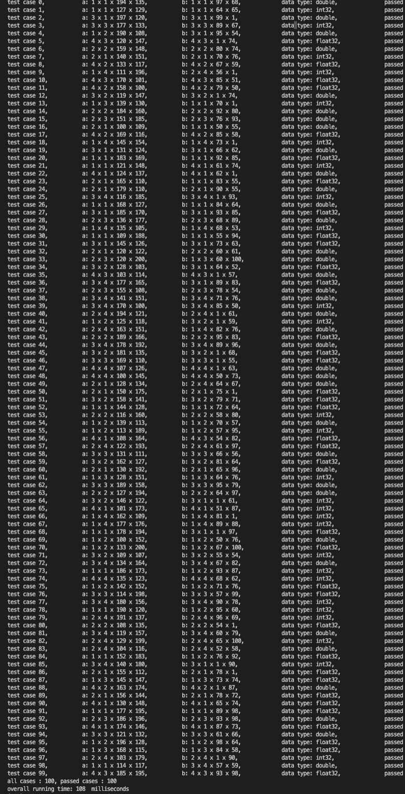

# 使用C++实现 ` maxpool + add ` 的计算图

## 背景

最近找实习，方向是模型部署，算法底层推理框架、模型加速，接到某公司的题目, 要求如下:

>  implement a small compute graph which consists of a max_pooling op and an element-wise add (support broadcast) op in C/C++.
>  Formula: **dst[32,64,56,56] = add(max_pooling(src1[32,64,112,112]), src2[32,1,56,56])**
>
>  - `max_pooling op is fixed to kernel [3,3], pad [1,1], stride [2, 2], src1 and src2 are the two input tensors, dst is the output tensor.`
>
>  - Forward only.
>
>  - Unit testing is required to verify the results

即实现 `maxpool` 和 `element-wise add` 操作，需要支持`broadcast`.  `maxpool`算子的`kernel / stride / pad` 参数固定. 

加分项是`SIMD`/ `openMP`/ `Cache locality`优化.

这里记录一下我的实现， 地址在 [github](https://github.com/Apexsf/max_pool_add)

## 实现

### Overview

- 使用 PyTorch 框架定义题目要求的计算图，生成随机尺寸大小的两个输入变量，然后用 PyTorch的 计算图前向传播得到输出结果，把输入变量和输出结果都序列化到磁盘上作为 test_cases, 然后在`c++`的实现中反序列化这些 test_cases 进行算子实现的测试.
- 使用`SIMD`/ `openMP`/ `Cache locality` 优化，优化的开启和关闭可以用 `conditional macro`控制，以便后续方便速度测试.

### Quick Start

- 使用python 脚本`generate_test_case.py`，调用`PyTorch`的算子生成测试样例，每个样例包括`3`个张量`a`,`b`,`c`, 其中 `a` 和 `b` 对应于 `src1`, `src2`, `c`对应正确的输出结果 `dst`.    
  生成脚本支持多种数据类型(`int`, `float`,`double`), 多种不同量级大小的张量，随机使得某一维度张量为`1`用来触发 `broadcast`等功能，具体可见`python generate_test_case.py -h`.
  生成的`a`, `b`, `c` 分别被展平为一维向量序列化保存到磁盘中.       

    ```
  python generate_test_case.py -s mid -n 100 -o test_case
    ```

  如上，生成 100 个中等大小的 case, 并保存到文件夹 `test_case`中.

- 编译`c++`代码：

  ```
  mkdir build && cd build
  cmake .. -DCMAKE_BUILD_TYPE=RELEASE -DUSE_OMP=ON -DUSE_AVX=ON
  make
  ```

- 运行编译得到的可执行程序 `mpa`, 该程序共一个输入参数用来指定测试样例的文件夹路径。程序运行时会读取每个 case 的`a`, `b`,`c` 文件，反序列化为自定义类型 `Tensor`.
  对于每一个`case`, 执行`c++`的`maxpool` 和 `add` 操作，输入为`a` 和 `b` 的 `Tensor`, 得到输出结果`res`. 之后比较`res` 与 `Pytorch` 的输出结果 `c` 是否一致来判断该` case `是否通过:

  ```
  cd ..
  ./build/mpa ./test_case
  ```

  执行结果如下:

  

### Details

#### 序列化和反序列化

- 使用 python 脚本进行序列化时，在张量前 `append` `4` 个维度信息，即`meta`数据：

  ```python
          a = torch.cat((torch.tensor(a.shape),  a.flatten()), dim = 0)
          b = torch.cat((torch.tensor(b.shape),  b.flatten()), dim = 0)
          c = torch.cat((torch.tensor(c.shape),  c.flatten()), dim = 0)
  ```

- `c++` 代码反序列化时，先读取前 `4`个元素，解析出维度信息，再读取之后的数据信息：

  ```cpp
  template<typename T>
  T* read_data_from_file(const char * path, T* shape) {
      std::ifstream input;
      input.open(path, std::ios::in | std::ios::binary);
      input.read((char*)shape, 4 * sizeof(T));
      size_t size =(size_t)shape[0] * (size_t)shape[1] * (size_t)shape[2] *(size_t) shape[3]; // cast to size_t to avoid overflow
      T * arr = (T *)malloc(size * sizeof(T));
      input.read((char*)arr, size * sizeof(T));
      input.close();
      return arr;
  }
  ```

#### 定义`Tensor`类

```c++
template<typename T>
struct Tensor {
    static_assert(std::is_same<T, float>::value 
    || std::is_same<T, double>::value 
    || std::is_same<T, int>::value 
    , "Tensor value types are restricted to double, float or int!");

    /**
     * @brief Default constructor, create a tensor that is not valid / initialized
     * 
     */
    Tensor() { }

    Tensor(size_t B, size_t C, size_t H, size_t W) : 
    B(B), C(C), H(H), W(W) {
         p = (T*)malloc(sizeof(T) * B * C * H * W);
    }

    /**
     * @brief Construct a new Tensor object by deserializing data from file
     * 
     * @param path: path of file from which to deserialize
     */
    Tensor(const char* path) { 
        T shape[4];
        p = read_data_from_file(path, shape);
        B = shape[0];
        C = shape[1];
        H = shape[2];
        W = shape[3];
    }


    Tensor(const Tensor<T>& t) { // copy
        B = t.B;
        C = t.C;
        H = t.H;
        W = t.W;
        size_t size = t.size();
        T* p = new T[size];
        memcpy(p, t.p, sizeof(T) * size);
    }

    Tensor(Tensor<T> && t) { // move
        B = t.B;
        C = t.C;
        H = t.H;
        W = t.W;
        if (p) delete[] p;
        p = t.p;
        t.p = nullptr;
    }

    ~Tensor() {
        if (p) {
            free(p);
        }
    }

    bool operator == (const Tensor<T>& t) const {
        if (B != t.B) return false;
        if (C != t.C) return false;
        if (H != t.H) return false;
        if (W != t.W) return false;
        size_t size = this->size();
        for (size_t i = 0; i < size; ++i) {
            if (p[i] != t.p[i]) 
                return false;
        }  
        return true;

    }

    size_t size() const{
        return B * C * H * W;
    }

    Stride stride() const {
        return Stride{C*H*W, H*W, W, 1};
    }

    void print_elems() const {
        size_t size = this->size();
        for( size_t i = 0; i < size; ++i) {
            std::cout << p[i] << std::endl;
        }
    }

    bool is_valid() const {
        return p != nullptr;
    }

    size_t B;
    size_t C;
    size_t H;
    size_t W;
    T* p = nullptr;
};
```

- `Tensor`类用来表示一个张量，支持`int`, `float`,`double` 共 3 种类型. 默认有`4`个维度，分别是`B`,`C`,`H`,`W`表示 `batch size`,  `channel`, `height`, `widht`.

- `Tensor`数据以一维数组形式存储在`heap`中, 通过指针`p`指向该块内存空间. 位置映射关系为:

  $Tensor[b][c][h][w] == Tensor.p[b*C*H*W + c*H*W + h*W + w*1]$

- 注意`H`和`W`在最后两个维度，这样可以使得这两个维度的数据在内存空间位置中相邻，可以提升后续`maxpool`操作的`cache locality`性能， 提高`cache`命中率.

#### maxpool 的实现

-  maxpool 可以通过直接的多层`for`循环实现, `darknet`和`caffe`都是使用这种方法， 另外也可以通过`im2col`加上`argmax`来实现。
-  这里主要采用`for`循环，以及使用`openmp`加速的方案.

```cpp
template<typename T>
Tensor<T> max_pool(Tensor<T>& src) {
    // pre-allocated memory for holding all the following padded 2-D matrix.
    // all the elements are initialized as 0 to save the “0 assignment" in default padding.
    T* padding = (T*) calloc((src.H + 2) * (src.W + 2), sizeof(T)); 
    if (padding == nullptr) {
        abort();
    }
    size_t dst_H =  (src.H + 1) / 2;
    size_t dst_W =  (src.W + 1) / 2 ;
    Tensor<T> dst(src.B, src.C, dst_H, dst_W);

    Stride src_str = src.stride();
    Stride dst_str=  dst.stride();

    size_t b_i, c_i;
    for (b_i = 0 ; b_i < dst.B; ++b_i) {
        for(c_i = 0; c_i < dst.C; ++c_i) {
            padding_2D(src.p + b_i * src_str.stride_B + c_i * src_str.stride_C, padding, src.H, src.W); 
            max_pool_2D(padding, dst.p + b_i * dst_str.stride_B + c_i * dst_str.stride_C, src.H + 2, src.W + 2, dst_H, dst_W);
        }
    }
    free(padding);
    return dst;
}
```

- 在`for`循环中的`maxpool`实现中, 最外部对`B`和`C`维度进行循环。而在`H`和`W`的循环中，需要考虑`padding`. 

  - 这里先计算每个二维张量 (`H`和`W`维度) padding 需要的内存空间大小并进行申请，`T* padding = (T*) calloc((src.H + 2) * (src.W + 2), sizeof(T)); ` 
    注意需要在进入主循环前提前申请空间，一直到所有循环结束后释放，以避免重复的内存申请与销毁开销。

  - 使用`calloc`来使得所有的值初始化为`0`.

  - 对 `padding`的空间进行赋值，并使用`openmp`加速:

    ```c++
    template<typename T>
    void padding_2D(T* src, T* dst, size_t H, size_t W) {
        size_t i, j;
        #ifdef USE_OMP
        #pragma omp parallel private(i,j) num_threads(4)
        {
            #pragma omp for schedule(static)
        #endif
            for(i = 0 ; i < H; ++i) {
                for(j = 0; j < W; ++j) {
                    dst[(i + 1) * (W + 2) + j + 1] = src[i * W + j];
                }
            }
        #ifdef USE_OMP
        }
        #endif
    }
    ```

- 使用`padding`后的数组来执行二维张量的`maxpool`操作，依然可以使用`openmp`加速:

  ```c++
  template<typename T>
  void max_pool_2D(T* src, T* dst, size_t src_H, size_t src_W, size_t dst_H, size_t dst_W) {
      T max_elem;
      size_t i,j,k_i,k_j;
      #ifdef USE_OMP
      #pragma omp parallel private(i,j,k_i,k_j,max_elem) num_threads(4)
      {
          #pragma omp for schedule(static)
      #endif
          for(i = 0; i < src_H-2;  i += 2) {
              for (j = 0; j < src_W-2; j += 2) {
                  max_elem = src[i * src_W + j];
                  for(k_i  = 0; k_i < 3; ++k_i) {
                      for(k_j = 0; k_j < 3; ++ k_j) {
                          if (max_elem < src[(i + k_i) * src_W + j + k_j]) {
                              max_elem = src[(i + k_i) * src_W + j + k_j];
                          }
                      }
                  }
                  dst[(i/2) * dst_W + j/2] = max_elem;
              }
          } 
      #ifdef USE_OMP
      }   
      #endif
  }
  ```

#### `add` 的实现

- 两个向量的`elem-wise add`需要先进行维度的判断:

  ```cpp
  template<typename T> 
  int elem_wise_op_size_check(Tensor<T>& a, Tensor<T> & b) { 
      if (a.B != 1 && b.B != 1 && a.B != b.B) return -1;
      if (a.C != 1 && b.C != 1 && a.C != b.C) return -1;
      if (a.H != 1 && b.H != 1 && a.H != b.H) return -1;
      if (a.W != 1 && b.W != 1 && a.W != b.W) return -1;
      
      int broadcast_cnt = 0;
      if (a.B == 1 || a.C == 1 || a.H == 1 || a.W == 1) broadcast_cnt += 1;
      if (b.B == 1 || b.C == 1 || b.H == 1 || b.W == 1) broadcast_cnt += 2;
      return broadcast_cnt;
  }
  ```

  - 返回值为`int`, 表示不同的状态:
    - `-1`:  无法执行 `elem-wise `操作
    - `0` :  不需要进行 `broadcast`
    - `1`:  `a`需要进行`broadcast` 
    - `2`:  `b`需要进行`broadcast` 
    - `3`:  `a` 和 `b`都需要进行`broadcast` 

- 这`broadcast`操作主要通过`expand`来实现，即:

  ```cpp
  template<typename T>
  void expand(Tensor<T>& src, Tensor<T>& dst) { // expand for broadcast,  e.g., 4*1*200*1 -> 4*3*200*400 
      Stride src_str = src.stride();
      Stride dst_str = dst.stride();
      size_t src_index;
      size_t b_i, c_i, h_i, w_i;
      
      // adjust strides of dimensions with 1 to 0 for broadcasting.
      src_str.stride_B *= (src.B == 1 ? 0 : 1);
      src_str.stride_C *= (src.C == 1 ? 0 : 1);
      src_str.stride_H *= (src.H == 1 ? 0 : 1);
      src_str.stride_W *= (src.W == 1 ? 0 : 1);
  
      #ifdef USE_OMP
      #pragma omp parallel private(b_i,c_i,h_i,w_i, src_index) num_threads(4)
      {
          #pragma omp for schedule(static)
      #endif
          for(b_i = 0; b_i < dst.B; ++b_i) {
              for(c_i = 0; c_i < dst.C; ++c_i) {
                  for(h_i = 0; h_i < dst.H; ++h_i) {
                      for(w_i = 0; w_i < dst.W; ++ w_i) {
                          src_index = 0;
                          src_index += b_i * src_str.stride_B;
                          src_index += c_i * src_str.stride_C;
                          src_index += h_i * src_str.stride_H;
                          src_index += w_i * src_str.stride_W;
                          dst.p[b_i * dst_str.stride_B + c_i * dst_str.stride_C + h_i * 
                          dst_str.stride_H + w_i * dst_str.stride_W] = src.p[src_index];
                      }
                  }
              }
          }
      #ifdef USE_OMP
      }
      #endif
  }
  ```

  - 输入的`src`是需要进行`expand`的张量 ， 它的一个或者多个维度是`1`， 如它的维度为$4\times 1 \times 200\times 1$. `dst`是`expand`后的张量，如维度`expand`为$4\times 3\times 200\times 400$.
  - `expand`操作可以通过简单的映射关系来实现，同时也可以使用`openmp`加速.

- 执行 `add`操作

  ```cpp
  template<typename T>
  Tensor<T> add(Tensor<T>& a, Tensor<T>& b) {
      int states = elem_wise_op_size_check(a, b);
      if (states == -1) 
          return Tensor<T>(); // size mismatch, return an invalid tensor indicating elem-wise add cannot be applied to a and b.
      size_t res_B = std::max(a.B, b.B);
      size_t res_C = std::max(a.C, b.C);
      size_t res_H = std::max(a.H, b.H);
      size_t res_W = std::max(a.W, b.W);
  
      Tensor<T> res(res_B, res_C, res_H, res_W);
  
      if (states == 0) {  // no broadcast
          add_array(a.p, b.p, res.p, res.size());
      }else if (states == 1) { // broadcast a 
          Tensor<T> broadcast_a(res_B, res_C, res_H, res_W);
          expand(a, broadcast_a);
          add_array(broadcast_a.p, b.p, res.p, res.size());
      } else if (states == 2) { // broadcast b 
          Tensor<T> broadcast_b(res_B, res_C, res_H, res_W);
          expand(b, broadcast_b);
          add_array(a.p, broadcast_b.p, res.p, res.size());
      } else if (states == 3) { // broadcast a and b
          Tensor<T> broadcast_a(res_B, res_C, res_H, res_W);
          expand(a, broadcast_a);
          Tensor<T> broadcast_b(res_B, res_C, res_H, res_W);
          expand(b, broadcast_b);
          add_array(broadcast_a.p, broadcast_b.p, res.p, res.size());
      }
      return res;
  }
  ```

- `add`先进行维度检查，然后在执行必要的`broadcast`，之后通过`add_array`函数来实现向量化的加法操作.

  - `add array`属于典型的向量化操作，可以用`openmp`或者`SIMD`优化.
    这里通过`macro`来控制编译时使用的优化方式, 可以选择 `openmp` 和 `SIMD`中的一种，或者同时使用.

  - 通过`AVX`指令集来实现`SIMD`优化，需要对不同的数据类型`int`,`float`,`double`分别进行特化.

    ```cpp
    template<typename T> 
    void add_array(T* p_a, T*p_b, T* res, size_t size) {
        size_t i;
    
        #ifdef USE_OMP
        #pragma omp parallel shared(p_a, p_b, res) private(i) num_threads(4)
        {
            #pragma omp for schedule(static)
        #endif
            for(i = 0; i < size; ++i) {
                res[i] = p_a[i] + p_b[i];
            }
        #ifdef USE_OMP
        }
        #endif
    }
    
    #ifdef USE_AVX
    template <>
    void add_array(int* p_a, int*p_b, int* res, size_t size) {
        size_t i ;
        // present no substantial speeding up with both openmp and SIMD compared to using only openmp
        // see possible reasons: https://stackoverflow.com/questions/42895066/no-speedup-using-openmp-simd
        #ifdef USE_OMP
        #pragma omp parallel shared(p_a, p_b, res) private(i) num_threads(4)
        {
            #pragma omp for schedule(static)
        #endif
            for( i = 0; i <= size -8; i += 8){
                __m256i A = _mm256_loadu_si256((const __m256i*) (p_a + i));
                __m256i B = _mm256_loadu_si256((const __m256i*) (p_b + i));
                __m256i C = _mm256_add_epi32(A, B);
                _mm256_storeu_si256((__m256i*)(res + i), C);
            }
        #ifdef USE_OMP   
        }
        #endif
    
        i = size - 7;
        for(; i < size; ++i) {
            res[i] = p_a[i] + p_b[i];
        }
    }
    
    template <>
    void add_array(float* p_a, float* p_b, float* res, size_t size) {
        size_t i ;
        // present no substantial speeding up with both openmp and SIMD compared to using only openmp
        // see possible reasons: https://stackoverflow.com/questions/42895066/no-speedup-using-openmp-simd
    
        #ifdef USE_OMP
        #pragma omp parallel shared(p_a, p_b, res) private(i) num_threads(4)
        {
            #pragma omp for schedule(static)
        #endif
            for( i = 0; i <= size -8; i += 8){
                __m256 A = _mm256_loadu_ps((p_a + i));
                __m256 B = _mm256_loadu_ps((p_b + i));
                __m256 C = _mm256_add_ps(A, B);
                _mm256_storeu_ps((res + i), C);
            }   
        #ifdef USE_OMP
        }
        #endif
        i = size - 7;
        for(; i < size; ++i) {
            res[i] = p_a[i] + p_b[i];
        }
    }
    
    template <>
    void add_array(double* p_a, double* p_b, double* res, size_t size) {
        size_t i ;
        // present no substantial speeding up with both openmp and SIMD compared to using only openmp
        // see possible reasons: https://stackoverflow.com/questions/42895066/no-speedup-using-openmp-simd
    
        #ifdef USE_OMP
        #pragma omp parallel shared(p_a, p_b, res) private(i) num_threads(4)
        {
            #pragma omp for schedule(static)
        #endif
            for( i = 0; i <= size -4; i += 4){
                __m256d A = _mm256_loadu_pd((p_a + i));
                __m256d B = _mm256_loadu_pd((p_b + i));
                __m256d C = _mm256_add_pd(A, B);
                _mm256_storeu_pd((res + i), C);
            }   
        #ifdef USE_OMP
        }
        #endif
        i = size - 3;
        for(; i < size; ++i) {
            res[i] = p_a[i] + p_b[i];
        }
    }
    #endif // USE_AVX
    
    ```

## 测试结果

- 测试主要分为两个维度

  - 第一个维度是张量的尺寸大小, `generate_test_case.py`中定义了三个不同范围大小的张量，分为别`samll`, `mid`, `large`
  - 第二个维度是优化方式的选择, 主要包括：无任何优化, `openmp`优化, `SIMD`优化，`openmp` + `SIMD`优化
    - 注意`SIMD`优化只在求和操作中使用, `openmp`在大部分循环计算中都进行了使用。

- 测试结果如下(单位: milliseconds):

  |             | Small | Mid  | Large |
  | :---------: | :---: | :--: | :---: |
  |    None     |  118  | 3475 | 10817 |
  |    SIMD     |  105  | 3459 | 10649 |
  |   openmp    |  24   | 1149 | 4840  |
  | openmp+SIMD |  16   | 1074 | 4823  |

  - SIMD 对于性能的提升相对较小，因为SIMD只有在求和的时候才进行优化.
  - `openmp` 可以达到约`3`倍的速度提升.


## 后续

  提交代码实现后，结合之前的面试表现很快就获得了offer， 但是由于一些原因，选择了另一家，还是感谢可以获得这样一次宝贵的机会。